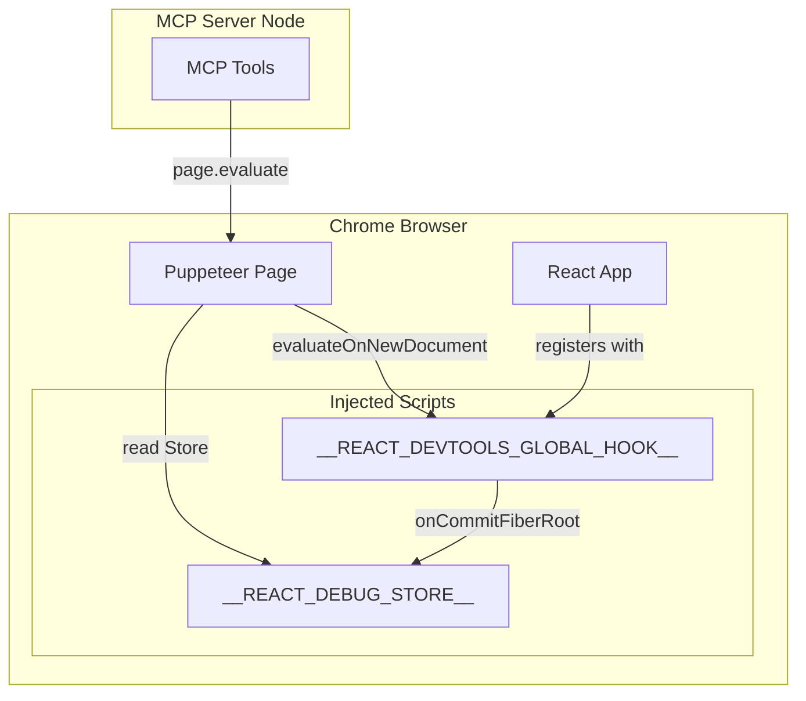

# React Debugging — Architecture and Usage

This document describes the React debugging layer added to chrome-devtools-mcp, which exposes React runtime behavior to AI agents via MCP tools.

## Architecture

### Overview

The React debugging layer uses the same mechanism as the React DevTools browser extension: the `window.__REACT_DEVTOOLS_GLOBAL_HOOK__` object. React checks for this hook when it loads and registers with it. Our bootstrap script creates the hook before React loads, then stores fiber roots and events for inspection.



### Data Flow

1. **enable_react_debug** injects the bootstrap script via `evaluateOnNewDocument` and `evaluate`. The bootstrap creates `__REACT_DEVTOOLS_GLOBAL_HOOK__` and patches `onCommitFiberRoot` to store roots and events in `__REACT_DEBUG_STORE__`.

2. When the user navigates to a React app (or reloads), the bootstrap runs before any page script. React loads, finds the hook, and calls `onCommitFiberRoot` on each commit. We store the roots and events.

3. **get_react_component_tree** and other tools call `page.evaluate()` with a function that reads from `__REACT_DEBUG_STORE__`, traverses the fiber tree, and returns JSON.

### Bootstrap Script

The bootstrap (`src/injected/react-debug-bootstrap.ts`) runs before React and:

- Creates `__REACT_DEBUG_STORE__` with `roots`, `events`, `propDiffs`, `stateUpdates`
- Creates or chains into `__REACT_DEVTOOLS_GLOBAL_HOOK__`
- Implements `inject` and `onCommitFiberRoot` to capture roots and commit events
- On each commit, traverses the fiber tree to diff `memoizedProps` and `memoizedState` between alternate fibers, populating `propDiffs` and `stateUpdates`
- Adds `componentNames` to each commit event (components that rendered in that commit)

## MCP Tools

| Tool | Description |
|------|-------------|
| **enable_react_debug** | Inject the React DevTools hook. Call before navigating to a React app. |
| **get_react_debug_status** | Check if React is detected and debug is active. |
| **get_react_component_tree** | Get the component tree with names, types, props, state. |
| **get_react_render_events** | Get recent render/commit events. |
| **get_react_render_timeline** | Get a chronological timeline of commits. |
| **get_prop_diffs** | Get prop changes between renders (limited). |
| **get_state_updates** | Get state/hook updates (limited). |
| **get_render_causes** | Get why components re-rendered. |
| **get_render_dependency_graph** | Get parent-child render relationships. |

## Example Usage

### Basic Flow

1. Call `enable_react_debug` to install the hook.
2. Navigate to a React app (or reload the current page).
3. Call `get_react_component_tree` to inspect the tree.

### Reconstructing a Timeline

An AI agent can reconstruct a runtime timeline:

```
User click
  → state update
  → component render (get_react_render_events)
  → child component renders (get_react_component_tree)
  → network requests (list_network_requests)
```

### Example: Diagnosing Re-renders

1. `enable_react_debug` + navigate to app
2. `get_react_component_tree` to see structure
3. Perform a user action (e.g. click)
4. `get_react_render_events` to see what rendered
5. `get_prop_diffs` or `get_render_causes` to understand why

## Limitations

- **Timing**: Profiler timings (`actualDuration`, `baseDuration`) exist only in React development builds.
- **Production**: Component tree and basic structure work in production; timings may be undefined.
- **Prop/state diffs**: Diffs are collected by comparing fiber `memoizedProps`/`memoizedState` with alternate fibers. Non-JSON-serializable values (DOM nodes, functions) are replaced with placeholders.
- **React versions**: Tested with React 17, 18, 19. Fiber structure may vary slightly.
- **Minified builds**: Display names may show as "Anonymous" when code is minified.
- **Multiple roots**: All roots are returned; use `rootCount` and `trees` to distinguish.

## Safety

- Tools return `{ error: "..." }` when React is not detected or debug is not enabled.
- The bootstrap uses try/catch to avoid crashing the page.
- No continuous profiling by default; data is pulled on demand.

## Files

| File | Purpose |
|------|---------|
| `src/injected/react-debug-bootstrap.ts` | Bootstrap script for hook injection |
| `src/tools/react.ts` | All React MCP tool definitions |
| `src/extensions/index.ts` | Registers React tools via `getCustomTools()` |
| `tests/tools/react.test.ts` | Unit tests for React tools |
